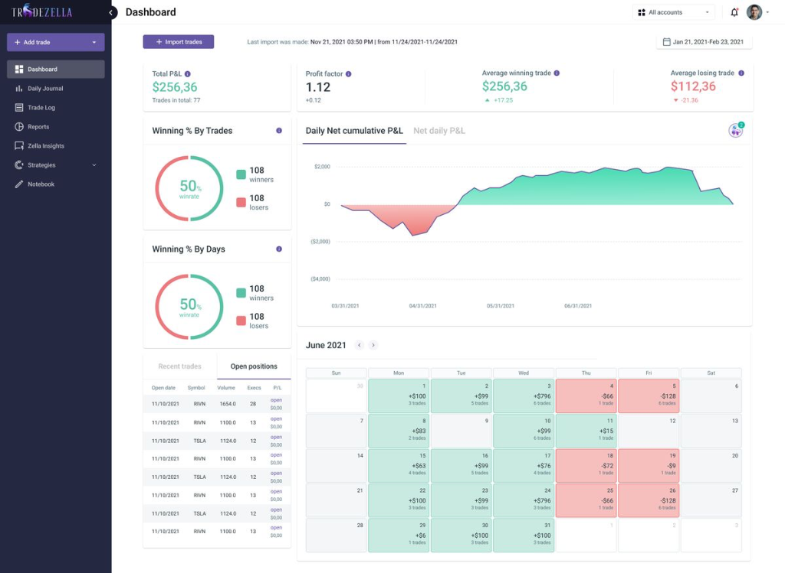

# 🚀 TradeForge - Professional Trading Journal & Analytics Dashboard

TradeForge is a fast, clean, and modern trading journal frontend inspired by TradeZella. It runs 100% locally in your web browser with zero backend requirements, keeping all your financial data private.



## ✨ Key Features

- **📊 Comprehensive KPI Metrics**:
  - Total Net P&L (colored dynamically with trades count)
  - Profit Factor (Gross Profit / Gross Loss ratio)
  - Average Winning Trade & Average Losing Trade
  - Win Rate % by Trades & Win Rate % by Days
- **📈 Interactive Dynamic Charts (Chart.js)**:
  - **Daily Net Cumulative P&L** (smooth equity curve area chart with positive/negative fill)
  - **Net Daily P&L** (bar chart showing daily performance)
  - **Win Rate Donut Charts** (Trades win rate & Days win rate with center counters)
  - **Instrument & Day of Week Breakdown** (bar charts in the Reports view)
- **📅 Monthly Trading Calendar Heatmap**:
  - Interactive monthly calendar with previous/next navigation
  - Daily Net P&L (e.g. `+$100`, `-$66`) and trade count tags
  - Color-coded cells: Green for profitable days, Red for losing days
  - Click any day to inspect individual trades executed on that date
- **📁 CSV Import & Intelligent Parser**:
  - Dedicated **Upload CSV** button in the top navigation bar
  - Drag-and-drop file dropzone
  - Smart column mapping supporting MetaTrader 4/5, cTrader, Tradovate, Prop Firm exports, and custom CSVs
  - Preloaded reference dataset (99+ trades across Gold `XAUUSD`, `BTCUSD`, `EURUSD`, `GBPJPY`, etc.)
- **📜 Filterable & Sortable Trade Log**:
  - Search by ticket, symbol, or close reason
  - Filter by Symbol, Direction (Buy/Sell), and Outcome (Winners/Losers)
  - Sort by date, profit, or volume with pagination
  - Click any trade to open the Trade Detail Modal
- **🧠 Zella Insights & Strategies**:
  - Best instrument analysis, Long vs Short ratio, and best trading day
  - Strategy playbook tracking
- **📝 Trader Notebook**:
  - Session notes and psychology reflections
  - Trading rules checklist auto-saved to browser `localStorage`
- **🔒 100% Client-Side Privacy**:
  - All data is stored in the browser (`localStorage`). No server tracking or external database required.

---

## 🛠️ Tech Stack

- **Frontend**: HTML5, Modern CSS3 (Variables, Flexbox, Grid, Glassmorphism, Animations)
- **Scripting**: Pure Vanilla JavaScript (ES6+ modular architecture)
- **Charts**: Chart.js v4
- **Typography**: Google Fonts (Plus Jakarta Sans, JetBrains Mono)
- **Storage**: Browser LocalStorage API

---

## 🚀 Getting Started

Simply clone the repository and open `index.html` in any modern web browser:

```bash
# Clone the repository
git clone https://github.com/Suraj-29489/TradeFourge.git

# Navigate to directory
cd TradeFourge

# Open in browser directly, or serve with Python:
python3 -m http.server 8000
```

Open your browser at `http://localhost:8000`.

---

## 📂 Project Structure

```
TradeFourge/
├── index.html              # Main application single-page interface
├── css/
│   ├── style.css           # Core styling, dark theme, sidebar, headers & layout
│   └── components.css      # Calendar grid, modals, stat cards, tables, badges & tooltips
├── js/
│   ├── app.js              # Main application controller, view routing & event listeners
│   ├── storage.js          # LocalStorage manager (save, load, clear, sample data)
│   ├── parser.js           # Multi-broker CSV parsing engine
│   ├── analytics.js        # Mathematical formulas (P&L, profit factor, win rates, streaks)
│   ├── charts.js           # Chart.js visualization renderer
│   └── calendar.js         # Interactive monthly trading calendar
├── data/
│   └── sample_trades.csv   # Bundled reference trading dataset
├── README.md               # Documentation & guide
└── .gitignore              # Git ignore rules
```

---

## 📄 License

MIT License. Designed with ❤️ for traders.
