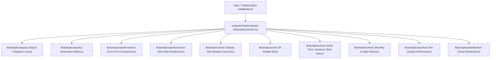

# TradeFourge Analytics Engine 1.0 Specification

The Analytics Engine in TradeFourge v3.8 is a pure mathematical calculation engine located under `lib/analytics/`.

---

## 1. Modular Analytics Architecture

---

## 2. Completed Modules & Implemented Metrics

### Phase 1 — Equity & Balance Engine (`lib/analytics/equity/`)
- **`calculateEquityAndBalanceCurve`**: Generates time-series array of timestamp, profit, running balance, equity, and peak equity watermarks.
- **`calculateDrawdownMetrics`**: Computes time-series drawdown amounts and percentage curves.

### Phase 2 — Core Performance Metrics (`lib/analytics/performance/core-performance.ts`)
- **`calculateCorePerformance`**: Computes Net Profit, Gross Profit, Gross Loss, Profit Factor, Expectancy, Average Trade, Average Winner, Average Loser, Largest Winner, and Largest Loser.

### Phase 3 — Directional & Temporal Win Rates (`lib/analytics/performance/win-loss.ts`)
- **`calculateWinLossBreakdowns`**: Computes Overall Win Rate, Win Rate by Symbol, Win Rate by Day, Win Rate by Week, Win Rate by Month, Long vs Short, and Buy vs Sell.

### Phase 4 — Risk & Ratio Metrics (`lib/analytics/risk/`)
- **`calculateRiskMetrics`**: Computes Max Drawdown ($ and %), Relative Drawdown, Recovery Factor (`Net Profit / Max DD`), Basic Sharpe Ratio (`(Mean Return / StdDev) * sqrt(252)`), and Risk:Reward Ratio (`Avg Win / Avg Loss`).
- **`calculateRMultipleDistribution`**: Categorizes trades into R-multiple risk buckets (`< -2R`, `-2R to -1R`, `-1R to 0R`, `0R to 1R`, `1R to 2R`, `> 2R`).

### Phase 5 — Time & Returns Analytics (`lib/analytics/time/`)
- **`calculateTimeAnalytics`**: Calculates Average, Median, Min, and Max hold duration in seconds; trading session win rates (Asian, London, New York, Overlap); Best Trading Hour (0–23 UTC); and Best Weekday.
- **`calculateReturns`**: Calculates Monthly Returns and Daily Returns aggregations.

### Phase 6 — Symbol Analytics (`lib/analytics/symbol/symbol-analytics.ts`)
- **`calculateSymbolAnalytics`**: Computes per-symbol Trade Count, Volume, Net PnL, Win Rate, Average Profit, Best Symbol, and Worst Symbol.

### Phase 7 — Chart Distribution Props (`lib/analytics/distribution/chart-distributions.ts`)
- **`generateChartDistributions`**: Generates pure data arrays for Equity Curve, Drawdown, Monthly Returns, Daily Heatmap, Win Distribution, and Profit Distribution charts.

---

## 3. Pure Calculation Rules
- **No Storage**: Performs no database mutations.
- **No Fetching**: Does not fetch API endpoints.
- **No React State**: Free of React hooks or component state.
- **Side-Effect Free**: Takes inputs and returns a structured `CompleteAnalyticsReport`.
