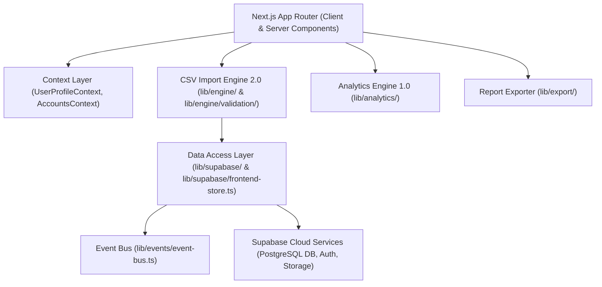

# TradeFourge System Architecture

TradeFourge is an institutional-grade SaaS trading journal and performance analytics application built with **Next.js 15 (App Router)**, **TypeScript**, **Tailwind CSS**, and **Supabase (PostgreSQL & Auth)**.

---

## 1. High-Level Architecture

---

## 2. Core Architectural Pillars

### 2.1 Dual-Mode Storage Architecture
TradeFourge supports seamless operation in both cloud and offline environments:
- **Cloud Mode (Default)**: Connects to Supabase PostgreSQL for persistent database synchronization, Row-Level Security (RLS) enforcement, and file storage.
- **Frontend-Only Fallback**: Automatically fallback to localStorage memory buffers when running without cloud credentials, allowing full journal evaluation and import workflows without setup friction.

### 2.2 CSV Import Engine 2.0 Architecture
Built as a 5-step institutional pipeline:
1. **Step 1: Account Validation & Selection** — Ensures every trade is assigned to a target Trading Account.
2. **Step 2: Non-blocking Drag & Drop Upload** — Accepts `.csv` statements and reads them into memory.
3. **Step 3: Modular Validation Engine** — Executes sequential checks (`file-validator`, `column-validator`, `broker-detector`, `data-validator`, `fingerprint`).
4. **Step 4: Import Preview & Duplicate Policy** — 20-row trade table preview with policy choices (`Skip`, `Overwrite`, `Cancel`).
5. **Step 5: Post-Import Audit Report & Exporters** — Displays final metrics dashboard and allows downloading CSV or PDF audit reports.

### 2.3 Pure Mathematical Analytics Engine 1.0
Decoupled pure calculation modules under `lib/analytics/`:
- **Inputs**: `TradeInput[]`, `initialBalance: number`
- **Outputs**: `CompleteAnalyticsReport`
- **Purity**: Zero side effects, no database calls, no React hooks, no state mutations.

### 2.4 Event-Driven Communication
Decoupled modules communicate across the application via an internal publish-subscribe event bus ([`lib/events/event-bus.ts`](file:///c:/Users/suraj/Desktop/Trading%20Journal/lib/events/event-bus.ts)) emitting events such as `tradefourge:data-changed`, `tradefourge:trade-created`, `tradefourge:trade-deleted`, and `tradefourge:import-created`.
