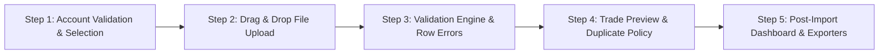

# TradeFourge CSV Import Engine 2.0 Specification

CSV Import Engine 2.0 is an institutional, multi-step CSV processing engine designed for TradeFourge v3.7.

---

## 1. Multi-Step Import Workflow

---

## 2. Detailed Step Specifications

### Step 1: Account Validation & Selection
- Checks authenticated user accounts.
- If zero accounts exist, blocks upload with a friendly onboarding screen and single action button (`Create Trading Account`).
- Displays a grid of target account cards displaying `Account Name`, `Broker`, `Currency`, `Platform`, and `Display ID`. Selection persists throughout the flow.

### Step 2: File Upload Experience
- Accepts `.csv` files via Drag & Drop or file browser button.
- Validates extension (`.csv`) immediately.
- Progress indicator displays live stages (`Uploading...` $\rightarrow$ `Reading CSV...` $\rightarrow$ `Validating...` $\rightarrow$ `Preparing Preview...`).
- Cancellation button clears memory buffer safely without database side effects.

### Step 3: Validation Engine (`lib/engine/validation/`)
Executes sequential modular checks:
1. `file-validator.ts`: File existence, non-emptiness, readability, text encoding.
2. `column-validator.ts`: Mandatory column check with fuzzy alias dictionary.
3. `broker-detector.ts`: Identifies format (`Exness`, `FTMO`, `IC Markets`, `MetaTrader 4`, `MetaTrader 5`, `cTrader`, `Generic Broker`).
4. `data-validator.ts`: Validates trade rows for unparseable dates, invalid volumes, directions, or profit values.
5. `fingerprint.ts`: Generates trade fingerprints and identifies in-file duplicates.
6. `validation-report.ts`: Aggregates all validator outputs into a `ValidationReport`.

### Step 4: Import Preview & Duplicate Resolution
- Displays statement metadata header (`Target Account`, `Currency`, `Broker`, `Platform`, `Filename`, `Size`, `Total Trades`).
- Displays 20-row sample trade table (`Ticket`, `Open Time`, `Close Time`, `Symbol`, `Side`, `Volume`, `Profit`).
- Interactive Duplicate Resolution Policy card:
  - **`Skip Duplicates` (Default)**: Automatically ignores matching database or in-file duplicate trades.
  - **`Overwrite Duplicates`**: Imports all valid statement trades, replacing matching existing records.
  - **`Cancel Import`**: Aborts workflow with zero database modifications.

### Step 5: Post-Import Audit Report & Exporters
- Displays final metrics dashboard: `Total Rows`, `Imported`, `Skipped`, `Failed`, `Duplicates`, `Warnings`, `Time Taken`, `Broker`, `Account`, `Currency`.
- Download buttons for **Export CSV Report** and **Export PDF Audit Document** ([`lib/export/import-report-exporter.ts`](file:///c:/Users/suraj/Desktop/Trading%20Journal/lib/export/import-report-exporter.ts)).

### High-Performance Streaming Batch Processor (`lib/engine/batch-processor.ts`)
Optimized for 10,000 to 50,000+ trade CSV files using non-blocking asynchronous batching (500 items/batch) with main-thread event loop yielding (`setTimeout(..., 5)`) to eliminate browser freezing.
