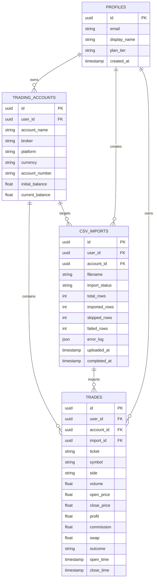

# TradeFourge Database Schema & Data Layer Architecture

TradeFourge uses **Supabase PostgreSQL** as its primary cloud database, secured with Row-Level Security (RLS) policies.

---

## 1. Entity Relationship Diagram (ERD)

---

## 2. Table Specifications

### 2.1 `trading_accounts` Table
Stores trading account parameters:
- `id` (UUID, Primary Key)
- `user_id` (UUID, Foreign Key $\rightarrow$ `profiles.id`)
- `account_name` (Text)
- `broker` (Text e.g. "Exness", "FTMO", "IC Markets")
- `platform` (Text e.g. "MetaTrader 5", "cTrader")
- `currency` (Text e.g. "USD", "EUR", "USC")
- `account_number` (Text, optional)
- `initial_balance` (Numeric)
- `current_balance` (Numeric)

### 2.2 `csv_imports` Table
Stores statement audit records:
- `id` (UUID, Primary Key)
- `user_id` (UUID, Foreign Key $\rightarrow$ `profiles.id`)
- `account_id` (UUID, Foreign Key $\rightarrow$ `trading_accounts.id`, optional)
- `filename` (Text)
- `import_status` (Text: `'pending'`, `'processing'`, `'success'`, `'partial'`, `'failed'`)
- `total_rows` (Integer)
- `imported_rows` (Integer)
- `skipped_rows` (Integer)
- `failed_rows` (Integer)
- `error_log` (JSONB)
- `uploaded_at` (Timestamp with time zone)
- `completed_at` (Timestamp with time zone)

### 2.3 `trades` Table
Stores normalized trade records:
- `id` (UUID, Primary Key)
- `user_id` (UUID, Foreign Key $\rightarrow$ `profiles.id`)
- `account_id` (UUID, Foreign Key $\rightarrow$ `trading_accounts.id`)
- `import_id` (UUID, Foreign Key $\rightarrow$ `csv_imports.id`, optional)
- `ticket` (Text)
- `symbol` (Text e.g. "XAUUSD", "EURUSD")
- `side` (Text: `'BUY'`, `'SELL'`)
- `volume` (Numeric float, lot size)
- `open_price` (Numeric float)
- `close_price` (Numeric float)
- `stop_loss` (Numeric float, optional)
- `take_profit` (Numeric float, optional)
- `profit` (Numeric float USD)
- `commission` (Numeric float USD)
- `swap` (Numeric float USD)
- `outcome` (Text: `'WIN'`, `'LOSS'`, `'BREAKEVEN'`)
- `open_time` (Timestamp with time zone)
- `close_time` (Timestamp with time zone)

---

## 3. Row-Level Security (RLS) & Storage Modes

### RLS Policies
All tables enforce PostgreSQL RLS policies where `auth.uid() = user_id`. Users can only query, insert, update, or delete their own data.

### Dual-Mode Architecture
If environment variables for Supabase are missing (`NEXT_PUBLIC_SUPABASE_URL`), the application automatically falls back to `lib/supabase/frontend-store.ts`, storing data in browser localStorage with matching TypeScript interfaces.
