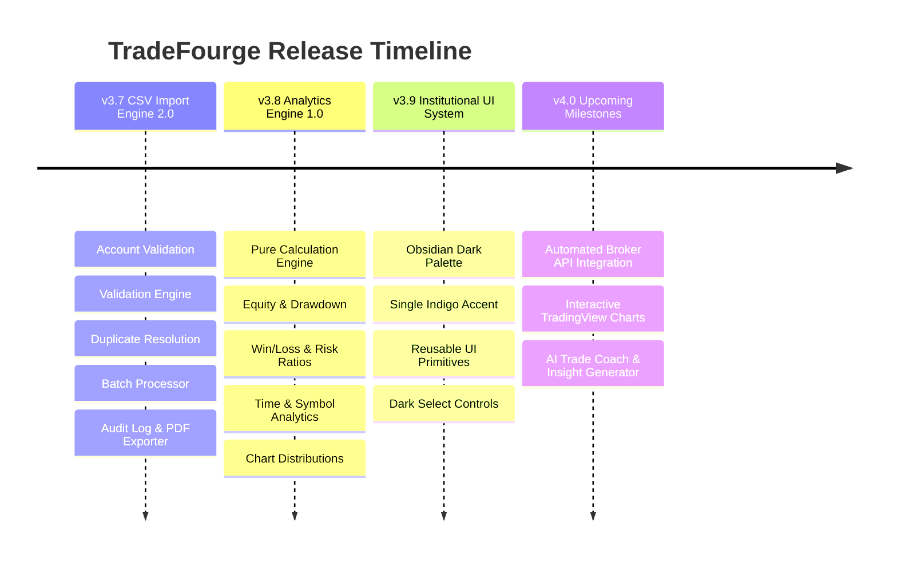

# TradeFourge Product Roadmap & Vision

This document outlines completed milestones, current platform status, and upcoming roadmap goals for TradeFourge.

---

## 1. Milestone Status Overview

---

## 2. Completed Milestones

### ✅ v3.7 — CSV Import Engine 2.0 (Phases 1–10 Complete)
- **Account Validation & Onboarding**: Blocks statement uploads when zero accounts exist, prompting account creation.
- **Drag & Drop Upload**: Non-blocking drag & drop experience with live progress indicator.
- **Modular Validation Engine**: `file-validator`, `column-validator`, `broker-detector`, `data-validator`, `fingerprint`.
- **Data Normalization**: Canonical symbol mapping (`GOLD` $\rightarrow$ `XAUUSD`), direction standardization, ISO 8601 UTC dates, `USC` cent normalization ($\div 100$).
- **Row Error Audit Inspector**: Detailed error table displaying line numbers and failure reasons.
- **Trade Sample Preview & Duplicate Resolution**: 20-row sample preview with policy choices (`Skip`, `Overwrite`, `Cancel`).
- **Post-Import Audit Dashboard & Exporters**: Summary metrics dashboard with CSV & PDF audit report downloads.
- **Import History Audit Log**: Multi-field search, summary modal, re-import router, cascading delete execution.
- **High-Performance Streaming Batch Engine**: Event loop yielding (`setTimeout(..., 5)`) for 50,000+ trade CSV datasets.

### ✅ v3.8 — Pure Mathematical Analytics Engine 1.0 (Phases 1–7 Complete)
- **Decoupled Architecture**: Pure mathematical calculation modules under `lib/analytics/`.
- **Phase 1 Equity & Balance**: Equity curve, balance curve, peak equity, running balance, drawdown curve.
- **Phase 2 Core Performance**: Net profit, gross profit/loss, profit factor, expectancy, averages, extremes.
- **Phase 3 Win Rate Breakdowns**: Win rate by symbol, day, week, month, long vs short, buy vs sell.
- **Phase 4 Risk Metrics**: Max drawdown ($ and %), relative drawdown, recovery factor, Sharpe ratio, risk-reward ratio, R-multiple distribution buckets.
- **Phase 5 Time Analytics**: Holding duration stats, session performance (Asian, London, New York, Overlap), best hour, best weekday, monthly/daily returns.
- **Phase 6 Symbol Analytics**: Per-symbol trade count, lot volume, profit, best/worst symbol.
- **Phase 7 Chart Distributions**: Formatted chart props for Equity Curve, Drawdown, Monthly Returns, Daily Heatmap, Win Distribution, Profit Distribution.

### ✅ v3.9 — Institutional SaaS UI System
- **Obsidian & Slate Design Tokens**: Deep `#080B11` base, `#0F1420` card surfaces, `#161C2B` hover surfaces.
- **Single Accent Color**: Refined Indigo `#6366F1` accent across all controls and indicators.
- **Standardized Component Primitives**: `Button`, `Card`, `Badge`, `Modal`, `EmptyState`, `LoadingSkeleton`.

---

## 3. Upcoming Milestones

### 🚀 v4.0 — Automated Broker Sync & Live API Integration
- Real-time trade synchronization via MetaTrader 4/5 EA Webhooks, cTrader Open API, and Exness API.
- Automatic background trade updates without manual CSV statement uploads.

### 🚀 v4.1 — Interactive TradingView Charting Integration
- Embedded TradingView canvas rendering execution markers (Entry price, Exit price, Stop Loss, Take Profit lines) directly on candle charts.

### 🚀 v4.2 — AI Trade Coach & Behavioral Pattern Recognition
- AI-driven behavioral analysis flagging over-trading, revenge trading, tilted lot sizing, and session fatigue.
