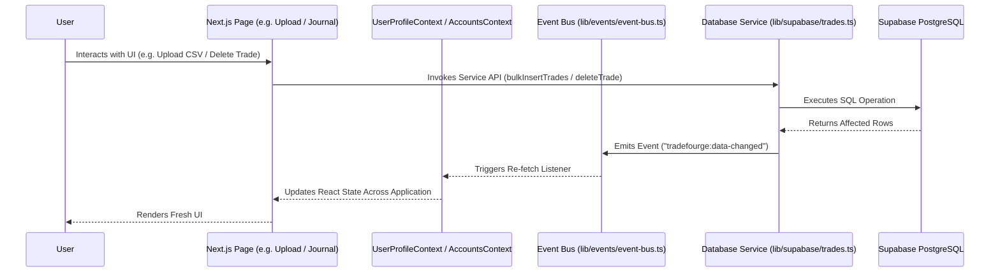

# TradeFourge State Flow & Event Architecture

This document describes how state is managed, initialized, and synchronized across components, React Contexts, and event listeners in TradeFourge.

---

## 1. Global State Flow Overview

---

## 2. Key State Flows

### 2.1 Authentication & User Profile Flow
1. User logs in via `/login` or `/signup`.
2. Supabase Auth session token stored in browser session.
3. `UserProfileContext` initializes user profile, subscription tier, and list of active `TradingAccount` records.

### 2.2 Account Selection & Persistence Flow
1. When navigating to `/upload` or `/journal`, `AccountsContext` provides the active trading account.
2. The user selects a target account in Step 1 of CSV Import Engine 2.0.
3. The selected `accountId` persists across all upload steps in component state (`selectedAccountId`).

### 2.3 CSV Import State Machine
`components/upload/CsvUploader.tsx` manages a 5-step state machine:
- `Step 1`: Target Account Selection
- `Step 2`: Drag & Drop File Upload (`isUploading: boolean`, `processingState: ProcessingStageState`)
- `Step 3`: Validation Engine Summary & Row Errors (`validationReport: ValidationReport | null`)
- `Step 4`: Import Preview & Duplicate Policy (`duplicatePolicy: "skip" | "overwrite" | "cancel"`)
- `Step 5`: Post-Import Report Dashboard & Exporters (`finalReport: FinalImportReportData | null`)

### 2.4 Event Bus Communication
The application uses `emitAppEvent` and `useAppEventListener` ([`lib/events/event-bus.ts`](file:///c:/Users/suraj/Desktop/Trading%20Journal/lib/events/event-bus.ts)) for decoupled updates:
- **`tradefourge:data-changed`**: Fired when trades or imports are added, updated, or deleted.
- **`tradefourge:trade-created`**: Fired after trade insertions.
- **`tradefourge:trade-deleted`**: Fired after trade deletions.
- **`tradefourge:import-created`**: Fired after a CSV statement record is created.
- **`tradefourge:import-deleted`**: Fired after an import record is purged.
